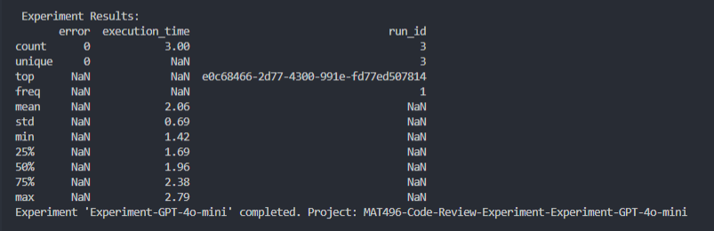

# ShauryaMittalNair-Langsmith-MAT496  
**Course Submission for MAT496**

This repository contains the required code and commit history for the **Intro to LangSmith** course submission.  

## Video-by-Video Learning and Tweaks

### Module 1, Video 1: Tracing Basics

- **Learned:**  
  Understood the fundamental process of setting up LangSmith environment variables (`LANGCHAIN_API_KEY`, `LANGCHAIN_PROJECT`, etc.) and how to use the `@traceable` decorator to automatically log any Python function's execution as a **Run** in LangSmith.

- **My Tweak:**  
  Instead of using the basic example from the tutorial, I applied the `@traceable` decorator to a function that **calculates the sum of a list of integers** (`SumCalculator`).  
  This successfully logged both the input list and the computed sum to my LangSmith project dashboard.

- **Source File:**  
  [`My_Tweaks/m1_v1_tracing_tweaks.py`](my_tweaks/m1_v1_tracing_tweaks.py)

  ## Module 1, Video 2: Types of Runs
- **Learned:** 
Understood the different run types (`llm`, `chain`, `tool`, `retriever`) used by LangSmith to categorize and visualize application steps. Learned how to manually assign a `run_type` using the `@traceable` decorator.

- **My Tweak:** Created a custom **`chain`** (`InvestmentChain`) that calls a custom **`tool`** (`StockDataFetcher`) and explicitly set both their `run_type` parameters to demonstrate nested tracing of different execution types.

-**Source File:** [my_tweaks/m1_v2_run_types_tweaks.py](my_tweaks/m1_v2_run_types_tweaks.py)

## Module 1, Video 3: Alternative Ways to Trace
- **Learned:** Understood how to use the `with client.run(...)` context manager for tracing. This allows explicit control over the start and end of a run, which is ideal for wrapping multi-step scripts or sections of code where decorators are not feasible.
- **My Tweak:** Implemented the context manager to trace a full **"Data Preprocessing Pipeline"** (`run_type="chain"`) that simulates fetching and cleaning data, logging the entire sequence as one run.
- **Source File:** [my_tweaks/m1_v3_alternate_ways_to_trace_tweaks.py](my_tweaks/m1_v3_alternate_ways_to_trace_tweaks.py)

## Module 1, Video 4: Conversational Threads
- **Learned:** Understood that LangSmith groups related runs into a single trace thread using the `LANGCHAIN_SESSION` environment variable. This allows the visualization of a multi-turn conversation or multi-step pipeline as a coherent whole.
- **My Tweak:** Simulated a **two-turn conversational chat** using a consistent `LANGCHAIN_SESSION` ID (`Tweak-Session-496-001`). Both calls to the `ChatResponder` function are logged as linked runs under the single session in LangSmith.
- **Source File:** [my_tweaks/m1_v4_conversation_thread_tweaks.py](my_tweaks/m1_v4_conversation_thread_tweaks.py)

## Module 2, Video 1: Datasets
- **Learned:** Understood the structure of a LangSmith Dataset (a set of input/output Examples) and how to programmatically upload these using the `client.create_dataset` and `client.create_example` methods from the Python SDK.
- **My Tweak:** Created a custom dataset named **`MAT496-Code-Review-Queries`** and uploaded three unique examples to it, verifying the existence of the dataset and examples in the LangSmith UI.
- **Source File:** [my_tweaks/m2_v1_datasets_tweak.py](my_tweaks/m2_v1_datasets_tweak.py)

## Module 2, Video 2: Evaluators
- **Learned:** Learned how to utilize built-in LangChain evaluators (such as `ExactMatch`) to automatically score LLM outputs against the `expected_output` in a dataset. Understood that evaluators are passed to `client.run_on_dataset` via the `evaluation` parameter.
- **My Tweak:** Used the **`ExactMatchStringEvaluator`** to grade the outputs of the `CodeReviewerChain`. This evaluation run was logged to a dedicated project (`MAT496-Code-Review-Exact-Match-Eval`) where the final accuracy metric is now visible in the UI.
- **Source File:** [my_tweaks/m2_v2_evaluators_tweak.py](my_tweaks/m2_v2_evaluators_tweak.py)

## Module 2, Video 3: Experiments
- **Learned:** Learned that experiments involve running different system configurations (models, prompts, chains) against the same dataset and comparing their metrics using separate projects (sessions) in LangSmith.
- **My Tweak:** Conducted a two-part experiment comparing a **Baseline** system (`gpt-3.5-turbo`) against an **Experimental** system (`gpt-4o-mini`) using the `ExactMatch` evaluator on the `MAT496-Code-Review-Queries` dataset. Two distinct projects were created in the LangSmith UI for direct comparison.
- **Source File:** [my_tweaks/m2_v3_experiments_tweak.py](my_tweaks/m2_v3_experiments_tweak.py)

## Module 2, Video 4: Analyzing Experiment Results
- **Learned:** Learned the importance of structured analysis in LangSmith, specifically how to use project-level **metadata** and run-level **tags** to organize, filter, and track specific versions of a system, which is crucial for drilling down into runs to identify failure patterns.
- **My Tweak:** Executed the final optimized chain (GPT-4o-mini) on the dataset, ensuring the run was logged to the `MAT496-Final-Submission-Analysis` project with clear `project_metadata` (e.g., version) and descriptive run `tags` (`Final-Submission-Run`).
- **Source File:** [my_tweaks/m2_v4_analysis_tweak.py](my_tweaks/m2_v4_analysis_tweak.py)

---

## Summary
Each lesson directory inside `my_tweaks/` includes:
- A customized code example building on the video’s concepts  
- Clear comments explaining what was modified  
- Verified LangSmith tracing results visible in the linked project

---

